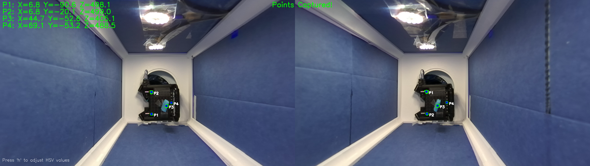

# MRI Template Localizer

This repository contains the implementation of a stereo vision-based needle tracking system used in MRI-guided interventional procedures. The system was developed to support template localization experiments using stabilizing needles with a single-sided low-field MR scanner.

## Overview

The tracking system uses a ZED stereo camera to detect and track multiple markers on both the template and needle in 3D space. It specifically tracks green markers and provides real-time position coordinates that are essential for:
- Template alignment perpendicular to the magnetic field
- Dynamic marker depth monitoring
- Precise needle tip position tracking
- Calculating transformations between physical and imaging coordinates


*Live tracking view showing stereo camera feed with detected marker points (P1-P4) and their 3D coordinates in millimeters. Left and right camera views demonstrate successful marker detection and stereo correspondence. The system tracks 4 points: 3 template markers and 1 needle tip marker, providing real-time position data used for template alignment and depth monitoring.*

## Requirements

- Python 3.6+
- OpenCV
- NumPy
- Pandas
- ZED SDK
- pyzed
- Matplotlib

## Hardware Requirements

- ZED Stereo Camera
- Template with green markers
- Stabilizer needle with tracking markers

## Installation

1. Install the ZED SDK from [stereolabs.com](https://www.stereolabs.com/developers/release/)

2. Install Python dependencies:
```bash
pip install opencv-python numpy pandas matplotlib
```

3. Clone this repository:
```bash
git clone [repository-url]
cd mri-template-localizer
```

## Usage

1. Configure tracking parameters in the config dictionary:
```python
config = {
    'num_points': 4,  # Number of points to track
    'hsv_lower': np.array([35, 50, 50]),    # Green color lower bound
    'hsv_upper': np.array([85, 255, 255]),  # Green color upper bound
    'min_contour_area': 1,
    'max_contour_area': 1000,
    'frame_average_count': 3,
    'pixel_tolerance': 5,
    'min_depth': 100,  # Minimum depth in mm
    'output_directory': 'needle_tracking_output'
}
```

2. Run the tracking script:
```bash
python stereo_needle_tracking.py
```

### Controls

- Press 's' to save current point coordinates
- Press 'h' to adjust HSV values for marker detection
- Press 'q' to quit

## Features

- Real-time 3D coordinate tracking of multiple points
- Coordinate smoothing using moving average
- HSV color-based marker detection
- Automatic data logging and export to Excel
- Snapshot saving capability
- Interactive HSV value adjustment
- Comprehensive error handling and logging

## Output

The system generates:
- Excel file with tracking data including timestamps and 3D coordinates
- Snapshot images of tracking sessions
- Detailed log file of tracking operations

## Data Format

The tracking data is saved in Excel format with the following columns:
- Timestamp
- X1, Y1, Z1 (coordinates for point 1)
- X2, Y2, Z2 (coordinates for point 2)
- etc. for each tracked point

## Experimental Context

This code was used in experiments for template localization using stabilizing needles with a low-field, single-sided Promaxo MRI scanner. The system achieved:
- Average XY accuracy: 1.7 mm
- Depth accuracy: 2 mm

For more details, refer to the related publication [citation pending].

## Troubleshooting

Common issues and solutions:

1. If markers are not being detected:
   - Use 'h' key to adjust HSV values
   - Ensure proper lighting conditions
   - Check marker size matches contour area settings

2. If depth values are incorrect:
   - Verify minimum depth setting
   - Ensure camera is properly calibrated
   - Check for reflective surfaces in the scene

## Authors

- **Nariman Nasab, PhD**
- **Vasanth Margabandhu**

## Acknowledgments

This work was funded by Promaxo and was part of research into improving template localization for MRI-guided interventional procedures.
